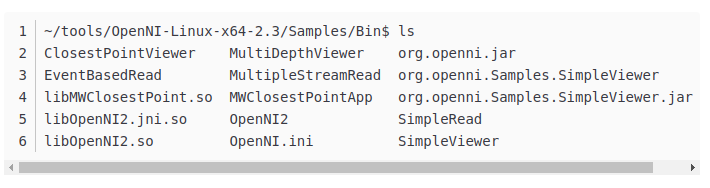
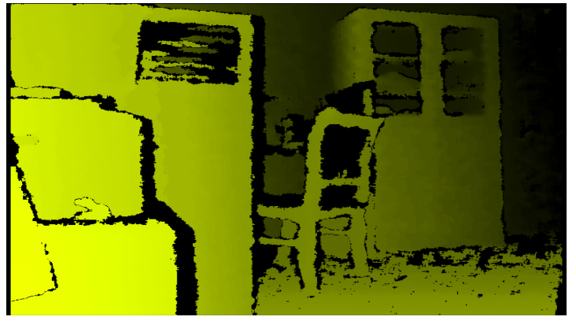
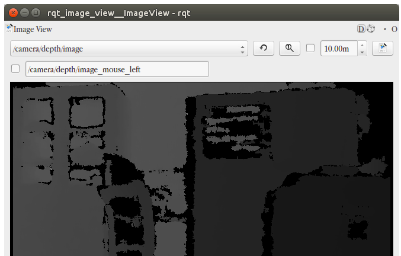
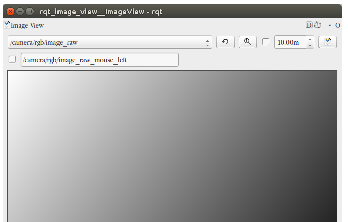
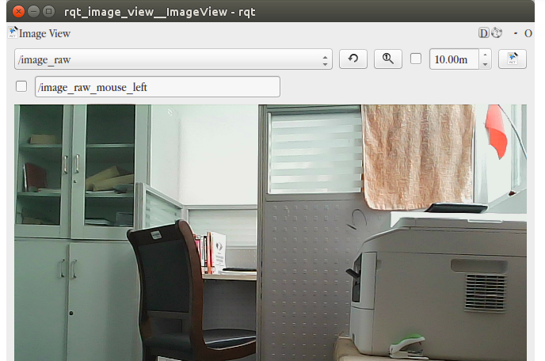

Orbbec Astra Pro sensor in ROS (indigo and kinetic) instructions for use rgb depth simultaneously displayed

This camera uses uvc to input color information, and libuvc and libuvc_ros are required to use the color function in ROS.

Please download the corresponding packages at the following URL

1 https://github.com/ktossell
2 https://orbbec3d.com/develop/

You can also download the packaged resources directly:

http://download.csdn.net/detail/zhangrelay/9705366

Install the driver first, select the appropriate version of the download driver according to the version

Install according to the following documentation: pay special attention to the marked part

############Note###################
# For user with ARM based development board:
# With CPU Structure older than Cortex A17, use OpenNI-Linux-Arm-2.3 Nofilter.tar for better performance
##################################
# There are two zip files, one is for 32bit machine, the other one is for 64bit
# We choose 64bit(x64) and make the example as follows:
Here should be the system is Ubuntu 16.04 64bit PC select the corresponding 64bit version
# To run visual samples(e.g., SimpleViewer), you will need freeglut3 header and libaries, please install:

$ sudo apt-get install build-essential freeglut3 freeglut3-dev 

#check udev version, Orbbec Driver need libudev.so.1, if can't find it, can make symbolic link from libudev.so.x.x,
#which usually locate in /lib/x86_64-linux-gnu or /lib/i386-linux-gnu

$ ldconfig -p | grep libudev.so.1
$ cd /lib/x86_64-linux-gnu
$ sudo ln -s libudev.so.x.x.x libudev.so.1
# copy tgz file to any place you want(e.g., Home)
# unzip tgz file

Copy to the corresponding folder and unzip:

$ tar zxvf OpenNI-Linux-x64-2.2-0118.tgz
$ cd OpenNI-Linux-x64-2.2

# run install.sh to generate OpenNIDevEnvironment, which contains OpenNI development environment 

$ sudo ./install.sh
 
# please replug in the device for usb-register
# add environment variables

$ source OpenNIDevEnvironment
# build sample(e.g., SimpleViewer)
$ cd Samples/SimpleViewer
$ make 
# run sample
# connect sensor
$ cd Bin/x64-Release
$ ./SimpleViewer

# now you should be able to see a GUI window showing the depth stream video
# If the Debian Jessie Lite is used for testing, it may require the following installation for properly start the viewer.

$ sudo apt-get install libgl1-mesa-dri

After installation, perform a functional test:

Use ./SimpleViewer and ./ClosestPointViewer, pay attention to the sensor characteristics, depth vision 0.4-8.0 meters, as follows:

Install the ROS function package, take kinetic as an example, indigo is similar:

$ sudo apt-get install ros-kinetic-astra-camera ros-kinetic-astra-launch

Found that rgb is not displayed correctly? ? Need UVC support.

The process of compiling libuvc is as follows: pay attention to the red part

`libuvc` is a cross-platform library for USB video devices, built atop `libusb`.
It enables fine-grained control over USB video devices exporting the standard USB Video Class
(UVC) interface, enabling developers to write drivers for previously unsupported devices,
or just access UVC devices in a generic fashion.

## Getting and Building libuvc

Prerequisites: You will need `libusb` and [CMake](http://www.cmake.org/) installed.

To build, you can just run these shell commands:

    git clone https://github.com/ktossell/libuvc
    cd libuvc
    mkdir build
    cd build
    cmake ..
    make && sudo make install

and you're set! If you want to change the build configuration, you can edit `CMakeCache.txt`
in the build directory, or use a CMake GUI to make the desired changes.

## Developing with libuvc

The documentation for `libuvc` can currently be found at https://int80k.com/libuvc/doc/.

Then compile libuvc_ros: pay attention to the red part

`libuvc_camera` is a ROS driver that supports webcams and other UVC-standards-compliant video devices.
It's a cross-platform replacement for `uvc_camera`, a Linux-only webcam driver.

Documentation is available on the ROS wiki: [libuvc_camera](http://wiki.ros.org/libuvc_camera).

Use catkin_make, if an error is reported, pay attention to the location of libusb.h. Use locate libusb.h and place it in a suitable location:

~$ sudo cp /usr/include/libusb-1.0/libusb.h /usr/local/include/libuvc/

Modify the path in include in libuvc.h.

After starting roscore, use:

~$ rosrun libuvc_camera camera_node

View rgb

An error occurred, modify the port permissions and try again

